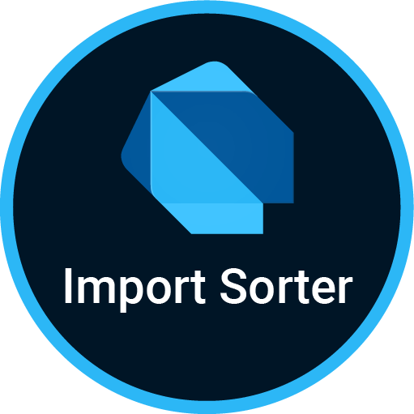

<p align="center">
   
</p>

<p align="center">
This is a VS Code extension that sorts your dart / flutter imports with a single command.
</p>

<p align="center">
    <a href="https://github.com/aziznal/dart-import-sorter/blob/main/LICENSE"></a>
    <a href="https://GitHub.com/aziznal/dart-import-sorter/releases/"></a>
    <a href="https://github.com/aziznal/dart-import-sorter/actions/workflows/test.yaml"></a>
</p>

## Usage

There are three ways to activate the extension:

1. Using the shortcut: `ctrl+alt+o`

2. Using the command palette:

    1. Open the command palette (Ctrl + Shift + P)
    2. Type and Run `Dart: Sort Imports`

3. Save your active document (with `sortOnSave` set to `true`).

## Features

By default, this extension will group your dart imports according to source and `package:<namespace>`.


### Sort On Save

You can set the extension to sort your dart imports whenever you save your
current active document. **This is set to `false` by default**, but can be changed in the extension settings.

### Custom Sorting Rules

You can set your own sorting rules so that imports will be grouped and ordered according to your preference.

#### How it works

The sorting algorithm only looks at a certain part of the import statement, namely the parts between the quotes. Keep this in mind when writing your own rules.

For example, the following:

```dart
import 'package:something/path/to/import.dart' as something_else;
```

is simplified to

```dart
'package:something/path/to/import.dart'
```

See the following example:

```jsonc
// settings.json
{
    "dartimportsorter.matchingRules": [
        {
            "label": "Flutter",
            "regex": "^package:flutter.*$",
            "order": 1,
            "regexFlags": ["m"]
        },
        {
            "label": "Dart",
            "regex": "^dart:.*$",
            "order": 2,
            "regexFlags": ["m"]
        },
        {
            "label": "Everything else",
            "regex": ".*",
            "order": 3,
            "regexFlags": ["m"]
        }
    ]
}
```

#### Default Sorting Rules

The extension comes with the following default rules:

```json
[
    {
        "label": "Dart",
        "regex": "^dart:.*$",
        "order": 1,
        "regexFlags": ["m"]
    },
    {
        "label": "Flutter",
        "regex": "^package:flutter/.*$",
        "order": 10,
        "regexFlags": ["m"]
    },
    {
        "label": "Package imports that are NOT your app",
        "regex": "^package:(?!<app_name>).*$",
        "order": 100,
        "regexFlags": ["m"]
    },
    {
        "label": "Package imports that ARE your app",
        "regex": "^package:<app_name>.*$",
        "order": 101,
        "regexFlags": ["m"]
    },
    {
        "label": "Relative",
        "regex": "^\\..*$",
        "order": 1000,
        "regexFlags": ["m"]
    }
]
```

You project name is detected automatically from pubspec.yaml and replaces `<app_name>` when the extension is used. You can use the `<app_name>` placeholder in any custom rules you write.

If you don't provide custom rules in settings.json, then the extension will use these rules by default. If you provide any configuration whatsoever, then the extension will use only your configuration, completely disregarding the defaults.

### Other Settings

```jsonc
{
    "dartimportsorter.leaveEmptyLinesBetweenGroups": true
}
```

---

## Release Notes

See [Changelog](./CHANGELOG.md)

## Contribution

Make a pull request with your changes to be merged with the `develop` branch as it's what I use for staging. Reference an issue if it's available and add me (@aziznal) as a reviewer. Make sure unit tests pass and we'll get your PR sorted in no time! Oh, and please add unit tests for any new features that may require them.

## If you have any questions, contact me at aziznal.dev@gmail.com

### Note

Configuration inspired by [this extension (typescript import sorter)](https://github.com/SoominHan/import-sorter)

---

<a href="https://www.buymeacoffee.com/aziznal" target="_blank"></a>
