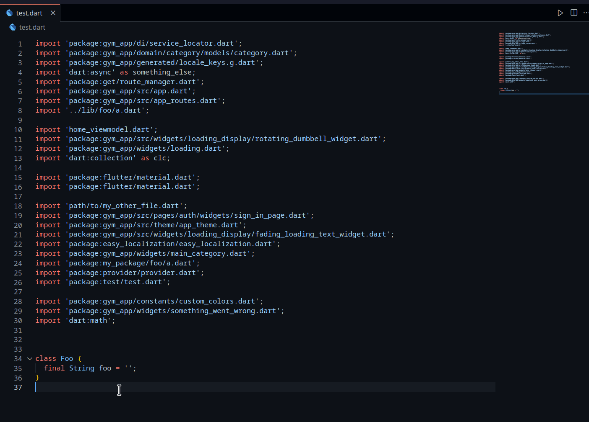

# Dart Import Sorter

This is a Vscode extension that sorts your dart / flutter imports with a single command!

## Usage

1. Open the command palette (Ctrl + Shift + P)
2. Type and Run `Dart: Sort Imports`

A configurable keyboard shortcut as well sort-on-save features will be added in the future

## Features

This extension will group your dart imports according to source and package:namespace.



### Custom Sorting Rules

You can set your own sorting rules so that imports will be grouped and ordered according to your preference.

#### How it works

The sorting algorithm only looks at a certain part of the import statement, namely the parts between the quotes. Keep this in mind when writing your own rules.

For example, the following:

```dart
import 'package:something/path/to/import.dart' as something_else;
```

is simplified to

```dart
'package:something/path/to/import.dart'
```

See the following example:

```jsonc
// settings.json
{
    "dartimportsorter.matchingRules": [
        {
            "label": "Flutter",
            "regex": "^package:flutter.*$",
            "order": 1,
            "regexFlags": ["m"]
        },
        {
            "label": "Dart",
            "regex": "^dart:.*$",
            "order": 2,
            "regexFlags": ["m"]
        },
        {
            "label": "Everything else",
            "regex": ".*",
            "order": 3,
            "regexFlags": ["m"]
        }
    ]
}
```

#### Default Sorting Rules

The extension comes with the following default rules:

```json
[
    {
        "label": "Dart",
        "regex": "^dart:.*$",
        "order": 1,
        "regexFlags": ["m"]
    },
    {
        "label": "Flutter",
        "regex": "^package:flutter.*$",
        "order": 10,
        "regexFlags": ["m"]
    },
    {
        "label": "Package imports that are NOT your app",
        "regex": "^package:(?!your_app_name_here).*$",
        "order": 100,
        "regexFlags": ["m"]
    },
    {
        "label": "Package imports that ARE your app",
        "regex": "^package:your_app_name_here.*$",
        "order": 101,
        "regexFlags": ["m"]
    },
    {
        "label": "Relative",
        "regex": "^\\..*$",
        "order": 1000,
        "regexFlags": ["m"]
    }
]
```

If you don't provide custom rules in settings.json, then the extension will use these rules by default. If you provide any configuration whatsoever, then the extension will use only your configuration, completely disregarding the defaults.

---

## Release Notes

-   ### 0.0.2

    Initial release. Extension can group imports and sorts imports within each group alphabetically.

## Contribution

Contact me at aziznal.dev@gmail.com. I'd love to collaborate!

---

### Note

Configuration inspired by [this extension (typescript import sorter)](https://github.com/SoominHan/import-sorter)
